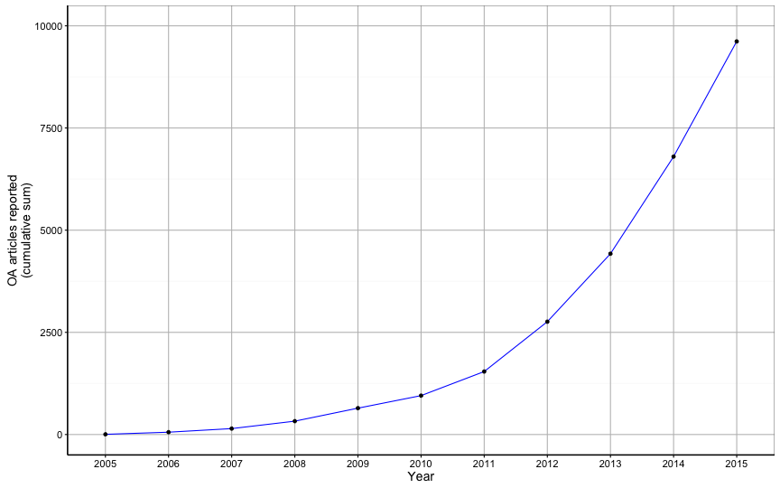
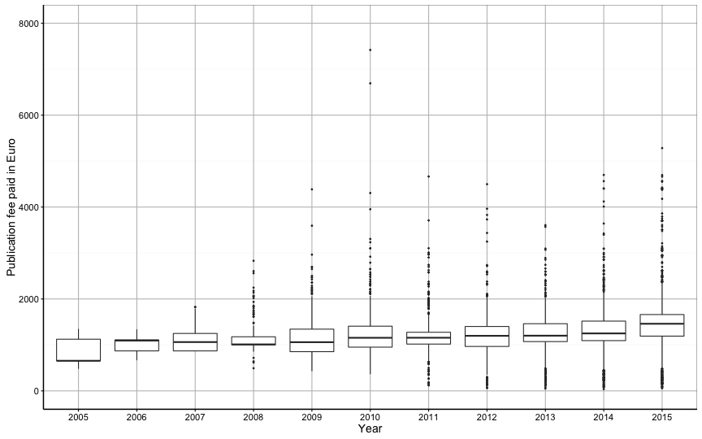
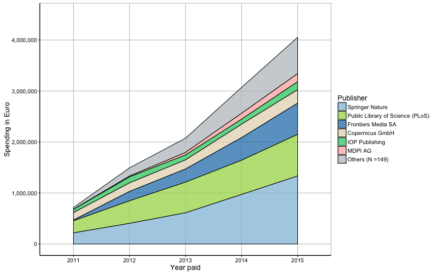
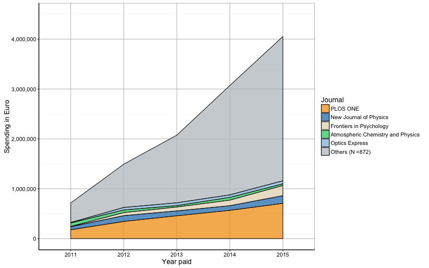

Using DOIs to assess the institutional support for open access publication fees
========================================================
author: Najko Jahn (SUB Göttingen, Germany)
date: 10th November 2016
autosize: true

Agenda
========================================================

- **General background**
-- Limitations of the study of spending on open access publication fees
- **Methods** 
  -- Crowdsourcing spending data and using Crossref to obtain metadata about open access journal articles
- **Results**
  -- Publication fee spending in Germany by publisher and journal
- **Discussion**
 -- Benefits and limits using Crossref
- **Open questions**

General Background
========================================================

Increasing relevance of open access publication fees, also APCs, in academic publishing

However, the study of publication fee spending has been limited for several reasons:
  - fragmentation of payments across various budgets
  - lack of transparency about who pays for what and the cost of publishing
  - fear of "double-dipping" when subscription costs and fees are not offsetted

Open Data to Open Access Publication Fees
========================================================

Several Austrian, German and UK initiatives have started to collect and share publication fee expenditure in 2014. 

**Metadata curation efforts**

- Thorough coverage of persistent IDs, especially DOI, but also PMID, along with administrative information
- To avoid confusion about naming of journals and publishers German [Open APC initiative](https://github.com/openapc/openapc-de) uses self-reported DOIs to gather bibliographic metadata from Crossref

Parsing Crossref TDM-XML
=======================================================

After requesting the `application/vnd.crossref.unixsd+xml` linking resource per DOI, following fields were parsed and merged with the spending data

|variable  |description     | node |
|:--------------|:---------|:-----------------|
|`doi`| Digital Object Identifier | `//ct:doi` |
|`journal_full_title` |Full Title of Journal  | `//journal_metadata//full_title` |
|`publisher` |Title of Publisher  | `//crm-item[@name='publisher-name']` |
|`issn` |International Standard Serial Numbers (collapsed) | `//journal_metadata//issn` |
|`issn_print` |ISSN print | `//journal_metadata//issn[@media_type='print']` |
|`issn_electronic`  |ISSN electronic | `//journal_metadata//issn[@media_type='electronic']` |
|`license_ref`  |License of the article | `//ai:license_ref` |

Method used for this talk
=======================================================

- analysed cost data from the Open APC initiative obtained on 7 Nov 2016 that only covers German universities and research institutions
- retrieved updated bibliographic information from Crossref by the DOIs to reflect ongoing mergers and name changes of publishers and journals
- extend Open APC metadata profile by adding Crossref `member_id`
- used the rOpenSci's `rcrossref:.cr_cn()` function to get the TDM-XML resource

Code and data used: <https://github.com/njahn82/pidapalooza_talk>

Results -- Cumulative growth of the Open APC initiative
========================================================

9,619 centrally supported open access articles shared by 36 German universities and research organisations

Cost distribution
========================================================

Indexing coverage in bibliographic databases
========================================================

|Sources  | Articles indexed| Proportion (in %)|
|:--------|----------------:|-----------------:|
|Crossref |             9515|                99|
|WoS      |             8192|                85|
|PMID     |             6994|                73|
|PMCID    |             6675|                69|

Participating institutions reported DOIs for 9,541 out of 9,619 articles to the Open APC initiative. These DOIs were used to retrieve metadata from Crossref, and to check indexing status in the Web of Science (`WOS`) and Europe PMC (`PMID`, `PMCID`).

Spending by publisher
========================================================

Representing Springer Nature merger by Crossref member ID
=======================================================

|Member         | Articles| Proportion (in %)| Mean fee (€)| SD (€)|
|:--------------|--------:|-----------------:|------------:|------:|
|297 (Springer) |     2672|              93.4|         1361|    313|
|339 (Nature)   |      189|               6.6|         1730|    873|

Spending per journal
========================================================

License information
=============================================

Top 5 license mentions in Crossref TDM-XML

|license_ref                                 | Articles| Proportion|
|:-------------------------------------------|--------:|----------:|
|NA                                          |     5530|      58.12|
|http://creativecommons.org/licenses/by/4.0/ |     2240|      23.54|
|http://www.springer.com/tdm                 |      819|       8.61|
|http://creativecommons.org/licenses/by/3.0/ |      623|       6.55|
|http://doi.wiley.com/10.1002/tdm_license_1  |       94|       0.99|

Discussion
==============================================

* Open Access journal articles where German research institutions covered the publication fee are thoroughly covered by Crossref

* Benefits using Crossref metadata services
  - no manual curation of bibliographic metadata
  - reliable open APIs and several metadata representations in place
  - great clients in place, e.g. [rOpenSci's rcrossref](https://github.com/ropensci/rcrossref) by [Scott Chamberlain](https://twitter.com/sckottie)
  
* Open questions
  - How are mergers of publishers and name changes be best represented?
  - How to motivate publishers to provide more infos to Crossref, especially licence information, at the article level?

Conclusion
=============================================

- Increasing need to make spending for open access publication fees transparent and to compare these expenditure across various levels
- Open Access articles where institutions covered publication fees are thoroughly covered in Crossref
- Re-using Crossref metadata, which publishers provided, extend existing methods to retrieve bibliographic metadata 
- However, open questions remain about versioning of metadata, especially how to represent mergers, and license coverage

=============================================

## Open APC Initiative

- [https://github.com/OpenAPC/openapc-de](https://github.com/OpenAPC/openapc-de)

Contact: Christoph Broschinski, Dirk Pieper <mailto:openapc@uni-bielefeld.de>

## Recent article 

- Jahn, N., & Tullney, M. (2016). A study of institutional spending on open access publication fees in Germany. PeerJ, 4, e2323. doi:[10.7717/peerj.2323](http://doi.org/10.7717/peerj.2323)

<mailto:najko.jahn@sub.uni-goettingen.de>

[http://twitter.com/najkoja](@najkoja)
